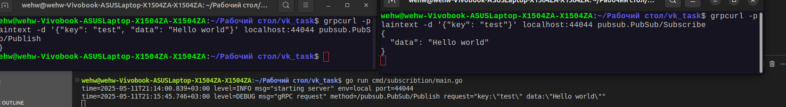

# PubSub Service

gRPC сервис для подписки и публикации событий.


## Описание

Сервис предоставляет два метода:
1. `Subscribe` - подписка на события по ключу (server-side streaming)
2. `Publish` - публикация события по ключу

## Установка

```bash
 git clone https://github.com/wehw93/vk_task.git
```

## Запуск

### 1. Установите зависимости:
```bash
go mod tidy
```

### 2. Сгенерируйте gRPC код:

```bash
make proto
```
### 3. Запустите тесты:
```bash
make runTestsSubPub
```

### 4. Запустите сервер:

```bash
make
```

## Пример работы

### В одном терминале запустите подписку:
```bash
grpcurl -plaintext -d '{"key": "test"}' localhost:44044 pubsub.PubSub/Subscribe
```
### В другом терминале отправьте сообщение:
```bash
grpcurl -plaintext -d '{"key": "test", "data": "Hello world"}' localhost:44044 pubsub.PubSub/Publish
```
### Должны увидеть:

{
  "data": "Hello world"
}

## Скриншот примера работы:



## Конфигурация
По умолчанию сервер запускается на порту 44044. Можно изменить конфигурацию в config/config.yaml.

## Особенности реализации
   - Используется паттерн Publisher-Subscriber из первой части задания

   - Реализован graceful shutdown

   - Используется dependency injection для передачи SubPub в сервис

   - Логирование выводится в stdout
   - 
## Объяснение решения

1. **Часть 1: SubPub**:
   - Реализована шина событий с поддержкой множества подписчиков
   - Каждый обработчик запускается в отдельной горутине, чтобы медленные подписчики не блокировали других
   - Сообщения обрабатываются в порядке публикации (FIFO)
   - Реализована корректная отписка и закрытие

2. **Часть 2: gRPC сервис**:
   - Использует пакет subpub из первой части
   - Реализует два метода: Subscribe (streaming) и Publish
   - Поддерживает graceful shutdown
   - Конфигурируется через структуру Config
   - Использует стандартные gRPC коды статуса

Сервис готов к масштабированию и может быть легко расширен дополнительной функциональностью.
